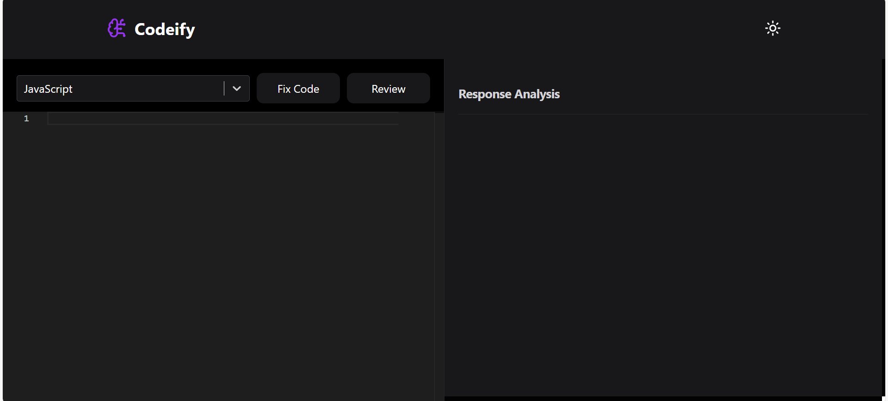

# 🤖 Codeify - AI Code Reviewer

<div align="center">
  
  
  
  
</div>

---

### 🌐 [Live Demo Link](https://kuverdeep-codeify.netlify.app/)

**Codeify** is a high-performance code analysis platform architected and designed by **Kuverdeep Pundir**. It leverages **OpenAI GPT-4** to provide instant, senior-level feedback on code quality, logic errors, and architectural improvements across 20+ programming languages.

## 🖼️ Preview

<div align="center">
  
</div>

---

## 🚀 Key Features

* **AI-Powered Analysis**: Uses GPT-4 via RapidAPI to evaluate logic and suggest advanced architectural patterns.
* **Professional Code Editor**: Integrates the **Monaco Editor** (the engine behind VS Code) for a robust development experience.
* **Multi-Language Support**: Seamlessly switches between JavaScript, Python, C++, Java, and more.
* **Modern UI/UX**: Features a minimalist dark-themed interface with high-contrast response text for maximum readability.
* **Real-time Feedback**: Provides instant reviews including bug identification and code quality ratings.

## 💻 Tech Stack & Knowledge Used

* **Frontend Library**: React (Vite)
* **Editor Engine**: @monaco-editor/react
* **Security**: API Key Authorization & Environment Variables
* **Styling**: Tailwind CSS & Custom CSS
* **API Integration**: Axios & RapidAPI (GPT-4)
* **Deployment**: Netlify (Continuous Deployment via GitHub)

## 🛡️ Authorization & Security

To protect the integrity of the application, this project implements:
* **Environment Variables**: API keys are managed via `.env` and are strictly ignored by Git to prevent exposure.
* **Header Authorization**: Requests are authorized using custom headers (`x-rapidapi-key` and `x-rapidapi-host`) to ensure verified communication with the AI gateway.

## 🛠️ Installation

1. **Clone the repo:**
   ```bash
   git clone (https://github.com/ishurana001/Codeify.git)

2. **Install dependencies:**
   ```bash
   npm install
   ```
3. **Add your OpenAI API key:**
   ```bash
   Create a .env file in the root and add:
   ```
4. **Run locally:**
   ```bash
   npm run dev
   ```
